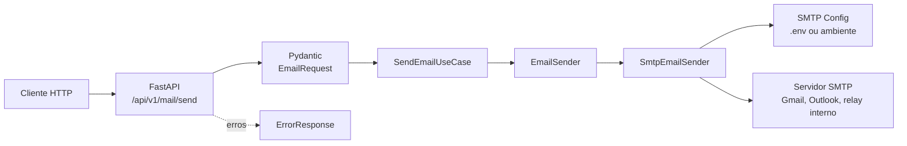

# mail-sender

API REST em Python 3.12 com FastAPI para envio de e-mails via SMTP.

O projeto expõe um endpoint HTTP para receber os dados da mensagem, validar a entrada e disparar o envio por um provedor SMTP configurado por variáveis de ambiente.

## Índice

- [Arquitetura](#arquitetura)
- [Tecnologias](#tecnologias)
- [Requisitos](#requisitos)
- [Configuração](#configuração)
- [Instalação](#instalação)
- [Execução](#execução)
- [Documentação da API](#documentação-da-api)
- [Enviar e-mail](#enviar-e-mail)
- [Erros da API](#erros-da-api)
- [Testes](#testes)
- [Segurança](#segurança)

## Arquitetura



### Camadas

- `src/api`: criação da aplicação FastAPI, rotas, schemas e tratamento padronizado de erros.
- `src/application`: caso de uso responsável por orquestrar o envio.
- `src/domain`: entidades, portas e exceções de domínio.
- `src/infrastructure`: leitura de configuração, carregamento de `.env` e integração SMTP.
- `tests`: testes unitários e de API com cobertura mínima de 100%.

## Tecnologias

- Python 3.12+
- FastAPI
- Uvicorn
- Pydantic
- pytest
- pytest-cov
- httpx

## Requisitos

- Python 3.12 ou superior
- Conta, relay ou servidor SMTP disponível
- Credenciais SMTP quando o provedor exigir autenticação

## Configuração

Crie o arquivo `.env` a partir do exemplo:

```powershell
Copy-Item .env.example .env
```

Variáveis suportadas:

| Variável | Obrigatória | Descrição |
| --- | --- | --- |
| `SMTP_HOST` | Sim | Host do servidor SMTP. |
| `SMTP_PORT` | Sim | Porta SMTP entre 1 e 65535. |
| `SMTP_FROM` | Sim | Endereço remetente usado no cabeçalho `From`. |
| `SMTP_USER` | Não | Usuário para autenticação SMTP. |
| `SMTP_PASSWORD` | Não | Senha ou senha de app para autenticação SMTP. |
| `SMTP_USE_TLS` | Não | Habilita STARTTLS. Valor padrão: `true`. |
| `API_HOST` | Não | Host usado pelo Uvicorn. Valor padrão: `0.0.0.0`. |
| `API_PORT` | Não | Porta da API. Valor padrão: `8000`. |

Exemplo para Gmail:

```env
SMTP_HOST=smtp.gmail.com
SMTP_PORT=587
SMTP_USER=seu-email@gmail.com
SMTP_PASSWORD='senha de app do gmail'
SMTP_FROM=seu-email@gmail.com
SMTP_USE_TLS=true
```

Para configurar envio pelo Gmail, veja [GMAIL_SETUP.md](GMAIL_SETUP.md).

Também é possível configurar pela sessão do PowerShell:

```powershell
$env:SMTP_HOST="smtp.gmail.com"
$env:SMTP_PORT="587"
$env:SMTP_USER="seu-email@gmail.com"
$env:SMTP_PASSWORD="senha de app do gmail"
$env:SMTP_FROM="seu-email@gmail.com"
$env:SMTP_USE_TLS="true"
```

## Instalação

Instale o projeto em modo editável com as dependências de desenvolvimento:

```powershell
python -m pip install -e ".[dev]"
```

## Execução

Execute a API:

```powershell
python -m main
```

A API ficará disponível, por padrão, em:

```text
http://127.0.0.1:8000
```

## Documentação da API

Com a API em execução, acesse:

- Swagger UI: http://127.0.0.1:8000/docs
- ReDoc: http://127.0.0.1:8000/redoc
- OpenAPI JSON: http://127.0.0.1:8000/openapi.json

## Enviar e-mail

Endpoint:

```text
POST /api/v1/mail/send
```

Payload:

```json
{
  "to": "destinatario@example.com",
  "subject": "Assunto do e-mail",
  "body": "Conteúdo da mensagem",
  "message_type": "HTML"
}
```

O campo `message_type` é opcional. Quando o valor é `HTML`, o corpo é enviado como HTML; nos demais casos, o conteúdo é enviado como texto simples.

Exemplo com PowerShell:

```powershell
Invoke-RestMethod `
  -Method Post `
  -Uri "http://127.0.0.1:8000/api/v1/mail/send" `
  -ContentType "application/json" `
  -Body '{"to":"outro-email@gmail.com","subject":"Teste Gmail","body":"Mensagem enviada pelo mail-sender via API REST"}'
```

Resposta esperada:

```json
{
  "message": "E-mail enviado com sucesso."
}
```

## Erros da API

Todos os erros retornados pelos endpoints usam o schema `ErrorResponse`:

```json
{
  "error": {
    "code": "string",
    "message": "string"
  }
}
```

Principais códigos:

| HTTP | `error.code` | Descrição |
| --- | --- | --- |
| 404 | `not_found` | Recurso não encontrado. |
| 422 | `validation_error` | Dados de entrada inválidos. |
| 500 | `email_send_error` | Falha ao enviar e-mail pelo SMTP. |
| 503 | `configuration_error` | Configuração SMTP ausente ou inválida. |

As mensagens de erro são retornadas em português do Brasil.

## Testes

Execute:

```powershell
python -m pytest
```

Os testes executam com cobertura mínima de 100% e não enviam e-mails reais.

## Segurança

- Não coloque senhas diretamente no código.
- Não versione credenciais reais no `.env`.
- Prefira variáveis de ambiente ou arquivo `.env` local para configurar `SMTP_PASSWORD`.
- Para Gmail, use uma senha de app em vez da senha principal da conta.
- Não exponha `SMTP_PASSWORD` em logs, respostas HTTP ou mensagens de erro.
